## **Amazon Web Services (AWS)**

## **TASKS**

- Create an S3 bucket, with a time stamp and your name

- Enable static website hosting, and bucket must be private

- But the tutor must be able to access your URL.

- Explore Cloudfront, to privately expose your index.html file in your S3 bucket.

## Getting Started

## Prerequisite

- Amazon Account
- An **index.html** file on local machine

## 1. Create a Bucket

Navigate to the S3 dashboard, and click on the Create bucket button. It will launch a new wizard

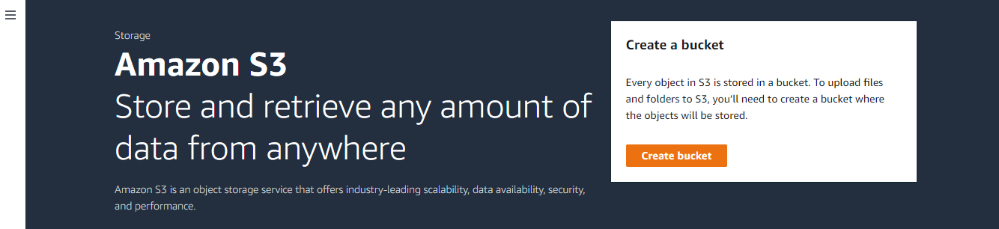

We create a bucket first, and later we upload files and folders to it.

## 2. General configuration

Provide the bucket-name. The bucket name must be unique worldwide e.g. demo-bucket-2022-12-09, and must not contain spaces or uppercase letters.

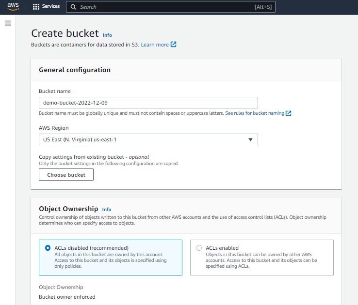

## 3. Private Access settings

Bock all public access.

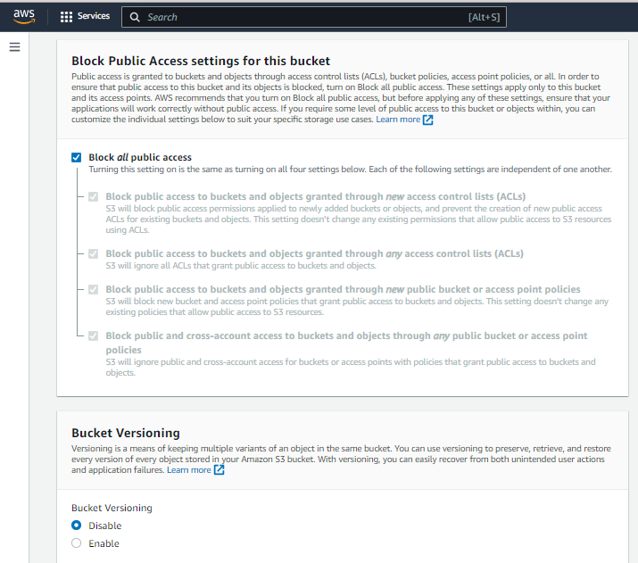

## 4. Bucket Versioning and Encryption

- Bucket Versioning - Keep it disabled.

- Encryption - If enabled, it will encrypt the files being stored in the bucket.

- Object Lock - If enables, it will prevent the files in the bucket from being deleted or modified

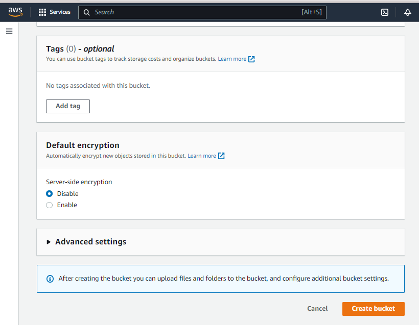

## 5. Upload File/Folders to the Bucket

From the S3 dashboard, click on the name of the bucket you have created in the step above

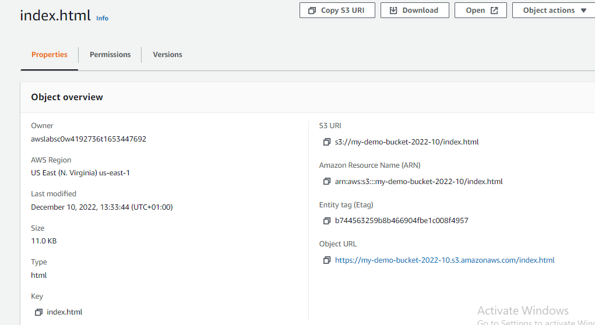

The snapshot above shows that the bucket is in the Region: US East (N. Virginia) us-east-1, and it has a unique Amazon resource name (ARN): arn:aws:s3:::my-demo-bucket-2022-10/index.html. You can view more details of the bucket.

In the snapshots above, we have created a private bucket. Let's see how to upload files and
folders to the bucket, and configure additional settings.

Click on the Upload button to upload files and folders into the current bucket. In the snapshot below, I have uploaded a index.html file.

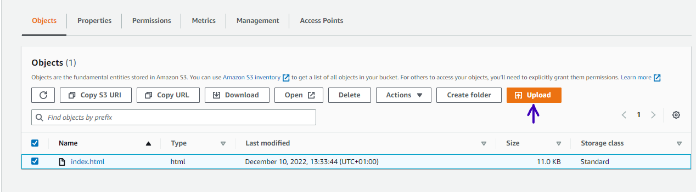

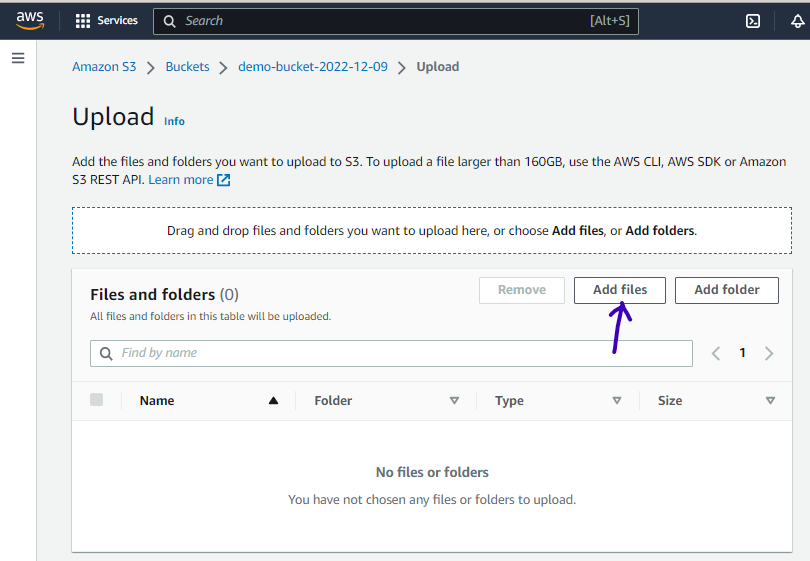

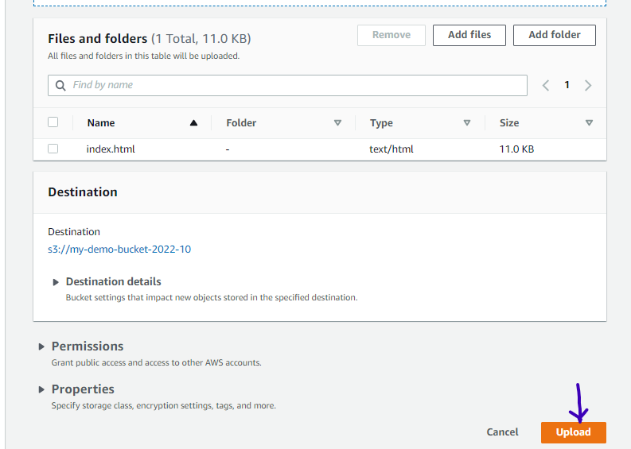

## 6. Enable Static Website Hosting

Click on your bucket properties

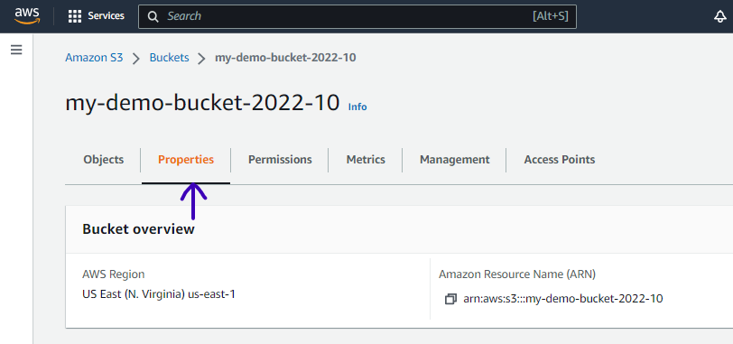

Scroll down to the bottom page and click on Edit icon

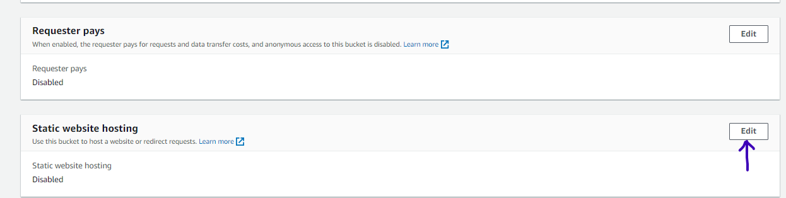

In the index document, write the name of your uploaded html file and click on **save changes**

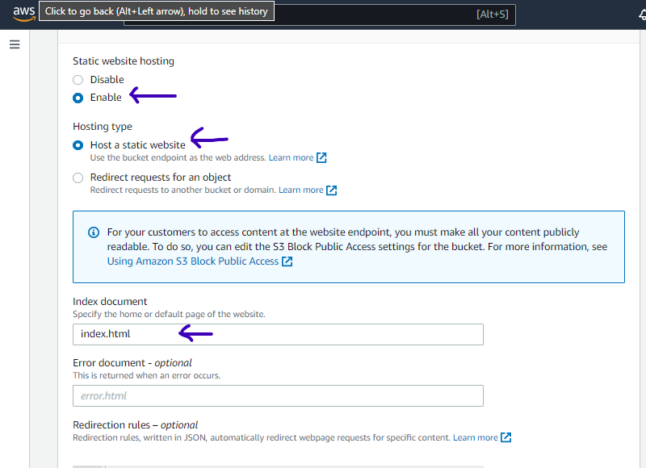

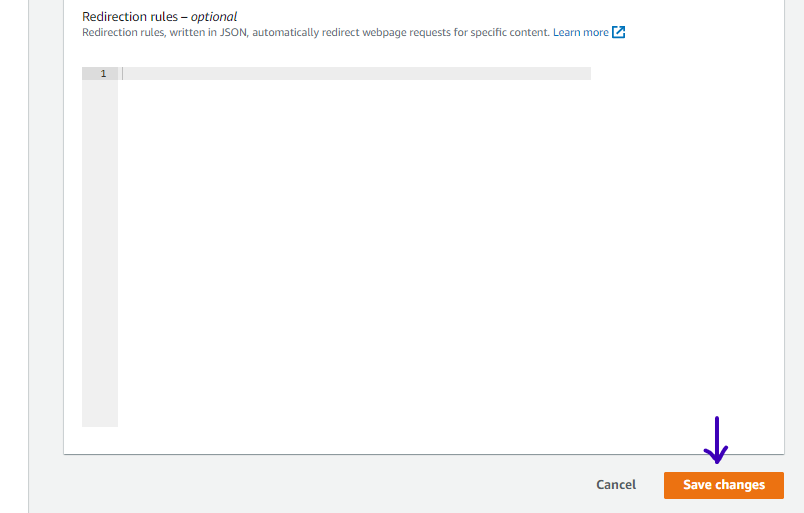

## 7. **Create Distribution**

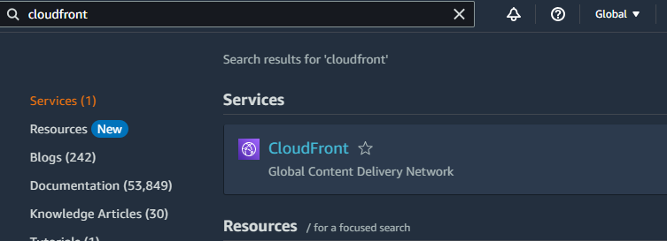

Now we will create CloudFront Distribution for our bucket. Currently, we do not have any distributions. We will click on Create Distribution.

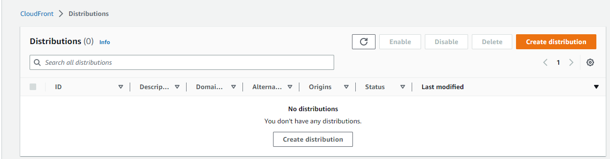

Here we will provide the Origin domain which in our case is from Amazon S3 i.e. **my-demo-bucket-2022-10.s3.us-east-1.amazonaws.com**. Note that an origin is a location where content is stored, and from which CloudFront gets content to serve to viewers.

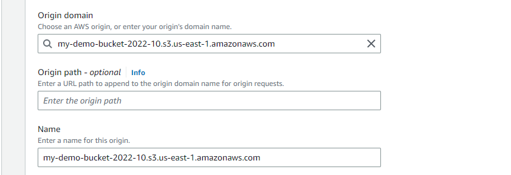

In S3 bucket access, we will select Yes use OAI as we are only restricting user access to CloudFront. To restrict access to content that we serve from Amazon S3 buckets, these steps are followed.

Creation of a special CloudFront user called an origin access identity (OAI) and its association with our distribution.
Configuration of S3 bucket permissions so that CloudFront can use the OAI to access the files in our bucket and serve them to our users. Make sure that users can’t use a direct URL to the S3 bucket to access a file there.

In Origin access identity, we will click on Create new OAI. For Bucket policy, we will select Yes, update the bucket policy. Here we are updating the bucket policy to allow read access to the OAI.

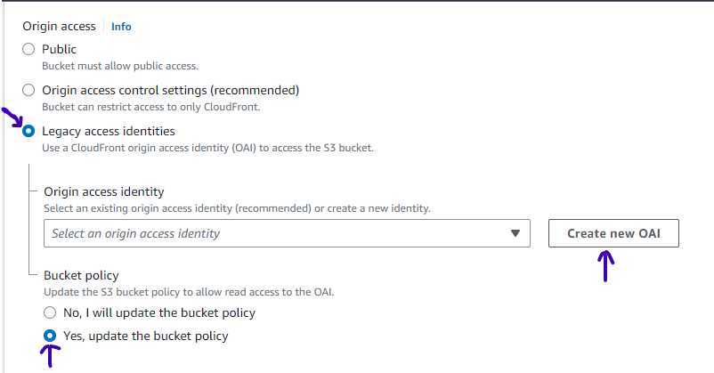

Here we will get a default name for OAI then we will click on Create.

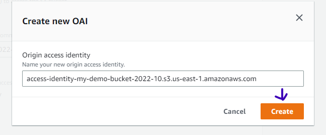

After these steps are taken, users can only access our files through CloudFront, not directly from the S3 bucket.

Redirect all HTTP request to HTTPS

In the **Default root object**, we will write the name of the file i.e. index.html that we uploaded to our bucket.
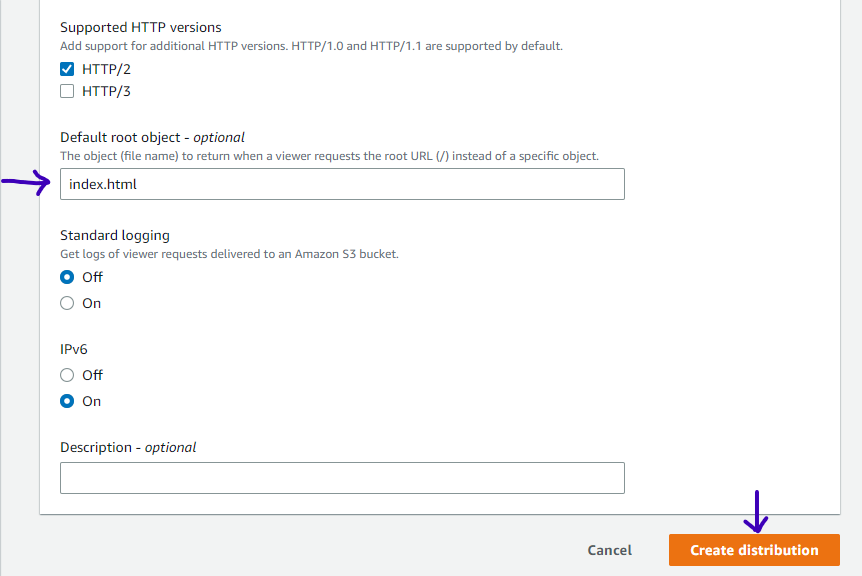

Now after creating our distribution we can view our newly created OAI.

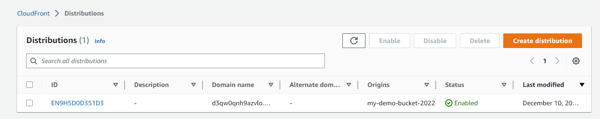

**Note** Remember, as soon as your CloudFront distribution is Deployed, it attaches to S3 and starts caching the S3 private pages. Once the caching is complete, the CloudFront domain name URL will stop redirecting to the S3 object URL. CloudFront may take 10-30 minutes (or more) to cache the S3 page, and you will be able to view the webpage, as shown below.

Now to check whether things are working properly let's test our CloudFront Distribution. We will copy the Distribution domain name and enter it into our browser.

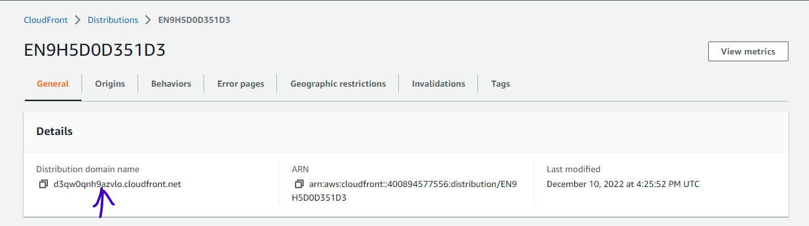

Our CloudFront Distribution is working perfectly fine. We have successfully learned that how to use CloudFront with S3.

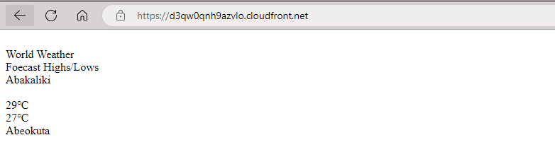
