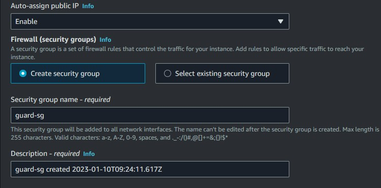

## Project Overview

Amazon Virtual Private Cloud (Amazon VPC) enables you to launch AWS resources into a virtual network that you’ve defined. A subnet is a range of IP addresses within the VPC. Subnets can be either public with a gateway to the internet or private.

Instances launched in a public subnet can send outbound traffic to the internet while instances launched in the private subnet can only do so via a network address translation (NAT) gateway in a public subnet.

Naturally private subnets are more secure, as the management ports aren’t exposed to the internet. Typically in a modular web application, the front end web server will reside within the public subnet while the backend database is in the private subnet.

Instances within the same VPC can connect to one another via their private IP addresses, as such it is possible to connect to an instance in a private subnet from an instance in a public subnet; otherwise known as a bastion host.

In this project, the use of an instance as a bastion host will be used to access two private instances in two private subnets and configure nginx web server in them using ansible configuration tool. It will be attached to a NAT gateway in a public subnet in order to access internet and a load balancer will be attached together with a target group to direct traffic accross the private instances.

### Application Load Balancer

A load balancer serves as the single point of contact for clients. The load balancer distributes incoming application traffic across multiple targets, such as EC2 instances, in multiple Availability Zones. This increases the availability of your application.

### Target Groups

A target group tells a load balancer where to direct traffic to : EC2 instances, fixed IP addresses; or AWS Lambda functions, amongst others. When creating a load balancer, you create one or more listeners and configure listener rules to direct the traffic to one target group.

## TASKS

- Set up two EC2 instances on AWS (use the free tier instances)
- Deploy an Nginx web server on these instances (you are free to use Ansible)
- Set up an ALB (Application Load balancer) to route requests to your EC2 instances
- Make sure that each server displays its own Hostname or IP address. You can use any programming language of your choice to display this.

### Important points to note:

- The web servers can not be accessed through their respective IP addresses. Access must be only via the load balancer
- A logical network should be defined on the cloud for the servers.
- EC2 instances must be launched in a private network.
- Instances should not be assigned public IP addresses.
- A custom domain name(from a domain provider e.g. Route53) or the ALB’s domain name must be submitted.

## STEPS

### 1. Create a VPC with two public and private subnets

- Click on AWS Services and go to Networking and Content Delivery
- Then click on VPC where the arrow is pointing at

Click on create VPC to setup the environment

Click on VPC and more to automatically setup a VPC and its subnets

- Mark the auto-generate botton.
- Provide a VPC name.
- Put the number of AZs to be two. This is to ensure high availability of your servers incase there is a downtime in one Availability Zone.
- You can see on the right, the subnets are been setup automatically.

- Number of public subnet should be two.
- Number of private subnet should be two.
- Choose NAT gateways in 1 AZ.

The other settings should be left in default and create VPC.

It is setting up the environment and will take 30secs to 1mins to finish up.

### 2. Lanuch EC2 instances in both public and private subnet

- Go to AWS services
- Click on compute
- Click on EC2

Click on launch instance

- Write the name of the instance
- Choose ubuntu Amazon Machine Image (AMI)

Choose Ubuntu 20.04 LTS focal image

Select a key pair, i have one already which is key.pem. You can generate by clicking the 'Create new key pair" and selecting it after it has been created.

Select the VPC that was created earlier and not the default

In the subnet section, select the public subnet, as this EC2 will serve as our bastion host.

- Enable IP address as we will ssh into it
- Create a security group
- Provide a name for the security group

Set the security group to allow inbound protocol for ssh, http, and https and lauch instance

We launch another instance for the private subnet. Here we give it a name and select Ubuntu AMI

- We select our defined logical VPC
- Select the private subnet in us-east-1a
- Disable IP address as we don't want it to have direct access to the internet
- From the "Select existing security group" we select the security group we created earlier
- launch instance

Create another instance using this step and assign it to a private subnet with no public IP address
