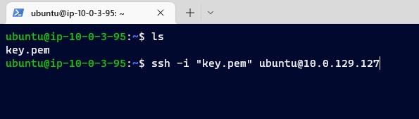
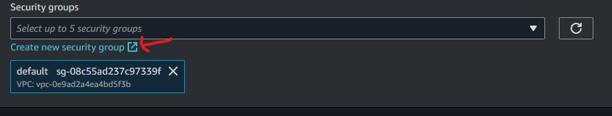

## PROJECT OVERVIEW

Amazon Virtual Private Cloud (Amazon VPC) enables you to launch AWS resources into a virtual network that you’ve defined. A subnet is a range of IP addresses within the VPC. Subnets can be either public with a gateway to the internet or private.

Instances launched in a public subnet can send outbound traffic to the internet while instances launched in the private subnet can only do so via a network address translation (NAT) gateway in a public subnet.

Naturally private subnets are more secure, as the management ports aren’t exposed to the internet. Typically in a modular web application, the front end web server will reside within the public subnet while the backend database is in the private subnet.

Instances within the same VPC can connect to one another via their private IP addresses, as such it is possible to connect to an instance in a private subnet from an instance in a public subnet; otherwise known as a bastion host.

In this project, the use of an instance as a bastion host will be used to access two private instances in two private subnets and configure nginx web server in them using ansible configuration tool. It will be attached to a NAT gateway in a public subnet in order to access internet and a load balancer will be attached together with a target group to direct traffic accross the private instances.

A load balancer serves as the single point of contact for clients. The load balancer distributes incoming application traffic across multiple targets, such as EC2 instances, in multiple Availability Zones. This increases the availability of your application.

A target group tells a load balancer where to direct traffic to : EC2 instances, fixed IP addresses; or AWS Lambda functions, amongst others. When creating a load balancer, you create one or more listeners and configure listener rules to direct the traffic to one target group.

## TASKS

- Set up two EC2 instances on AWS (use the free tier instances)
- Deploy an Nginx web server on these instances (you are free to use Ansible)
- Set up an ALB (Application Load balancer) to route requests to your EC2 instances
- Make sure that each server displays its own Hostname or IP address. You can use any programming language of your choice to display this.

### Important points to note:

- The web servers can not be accessed through their respective IP addresses. Access must be only via the load balancer
- A logical network should be defined on the cloud for the servers.
- EC2 instances must be launched in a private network.
- Instances should not be assigned public IP addresses.
- A custom domain name(from a domain provider e.g. Route53) or the ALB’s domain name must be submitted.

## STEPS

### 1. Create a VPC with two public and private subnets

- Click on AWS Services and go to Networking and Content Delivery
- Then click on VPC where the arrow is pointing at

Click on create VPC to setup the environment

Click on VPC and more to automatically setup a VPC and its subnets

- Mark the auto-generate botton.
- Provide a VPC name.
- Put the number of AZs to be two. This is to ensure high availability of your servers incase there is a downtime in one Availability Zone.
- You can see on the right, the subnets are been setup automatically.

- Number of public subnet should be two.
- Number of private subnet should be two.
- Choose NAT gateways in 1 AZ.

The other settings should be left in default and create VPC.

It is setting up the environment and will take 30secs to 1mins to finish up.

### 2. Lanuch EC2 instances in both public and private subnet

- Go to AWS services
- Click on compute
- Click on EC2

Click on launch instance

- Write the name of the instance
- Choose ubuntu Amazon Machine Image (AMI)

Choose Ubuntu 20.04 LTS focal image

Select a key pair, i have one already which is key.pem. You can generate by clicking the 'Create new key pair" and selecting it after it has been created.

Select the VPC that was created earlier and not the default

In the subnet section, select the public subnet, as this EC2 will serve as our bastion host.

- Enable IP address as we will ssh into it
- Create a security group
- Provide a name for the security group

Set the security group to allow inbound protocol for ssh, http, and https and lauch instance

We launch another instance for the private subnet. Here we give it a name and select Ubuntu AMI

- We select our defined logical VPC
- Select the private subnet in us-east-1a
- Disable IP address as we don't want it to have direct access to the internet
- From the "Select existing security group" we select the security group we created earlier
- launch instance

Create another instance using this step and assign it to a private subnet with no public IP address

## 3. Deploy Nginx Web Server with Ansible

We will ssh into our instance in the public subnet whhich serve as our bastion host and will also be our ansible master to automate the deployment to the instances in the private subnet.

- Go to instances
- Click on the mark button of the nginxConnect server that is in public subnet and select connect as shown with the arrow

Copy the link that is pointed by the arrow

- Open a terminal, here i used powershell
- Make sure you are in the folder that contains the private key as shown by the arrow. Mine is key.pem
- Paste the copied ssh link

- We are logged in into the bastion host
- so we copy the private key into our EC2 in order to enable us have an ssh connection into the private instances
- Run the command: nano key.pem; and paste the copied private key
- Run the command: chmod 400 key.pem; to give read priviledges only to the current user
- Run the command: ls -al; you can see where the arrow is pointing, it shows that only the current user has read permission for key.pem file

- When we ssh into our private instances, we will copy and paste the ssh public key of our bastion host into the authorized_keys of the private instances in order to allow ansible to access them
- So we generate the bastion host ssh key by running the command: ssh-keygen
- You leave all the option as defaults by clicking enter
- The key is generated and is been stored in the .ssh folder

- We cd into the .ssh folder
- Cat the id_rsa.pub file and copy it's content

- Go back to console and click on connect for one of the private instances following the previous procedure
- Then copy the ssh link and paste it on the bastion host EC2 terminal and click enter

- We have ssh into the private instance as it shows the private IP address of the private instance
- You cd into .ssh folder
- Run the command: nano authorized_keys
- Paste the copied id_rsa.pub key into the file and save

- Run the command: exit; to exit the private instance and back to the bastion host
- Run the command: sudo apt update; sudo apt upgrade -y; to update cached and upgrade the package repository

Run the command: sudo apt install ansible -y; to install ansible and its dependencies

- The first file to create is our ansible.cfg file
- Run the command: nano ansible.cfg

Paste this content on it and save

- Run the command: nano servers; this is where we put the IP address of the servers we want to reach and is known as host inventory
- When you cat the servers file, you will see our two private instance IP address are shown

For us to test if we can ping the two private instances, we run the command: ansible all -i servers -m ping; the connection to the instances were successful

- We create our playbook to deploy the nginx server that will the display the private IP address of the instances
- Run the command: ansible-galaxy init nginx; this creates the nginx role

We nano into the main.yml file inside tasks folder of nginx role

- We paste this script into it
- Note the tag that the arrow is pointing to, we will use only that task and not the whole script to restart our nginx server later on whenever it is unhealthy

We nano into the main.yml file inside the handler folder of nginx role

- We paste the this script into it
- This will start our nginx server after it has been installed

We nano into the main.yml file inside the vars folder of the nginx role

Paste this path into it as it will be called and read by our main.yml file in the tasks folder we created earlier that will send h1 tag into this path

- We create the final playbook which will run all the scripts we have created earlier
- Run the command: nano push.yml

Paste this script into it and save

- Run the command: ansible-playbook -i servers deploy.yml
- This will connect to the private servers and carry out all the tasks in our playbook scripts
- After running, you see in the PLAY RECAP, there was 4 changes, 5 was ok, and no other failures or issues

## 4. Create a Target Group

Click on target group as shown by the arrow

Click on create Target Group

Choose instances as your target type

- Give your target group a name
- Select the VPC you have already created on the drop down menu and leave the default protocol on Http
- Click on next

Then select the Private instances in your VPC

- Select include as pending as shown by the arrow
- Click on create target group

Currently there is no load balancer configured to this target group. Click on the None associated and select associate with a new load balancer

## 5. Create an Application Load Balancer

Give your Application Load Balancer a name

Then on Network Mapping select your VPC from the dropdown menu

Choose your public subnets associated with your VPC

For the Security Groups click on create new security group

Give your Security Group a name, brief description and ensure you choose your created VPC from the drop down menu

Edit the Inbound rules to allow Http and Https traffic from anywhere and leave Outbound rules on default. Then click on create and return to the previous page to assign the newly created Security Group

On the Listeners and routing section, select the target group previously created, leaving the rest of the configuration on default and finally click on create load balancers

## 6. Configuring Application Load Balancer Security Group

Click on security group as shown by the arrow

Select the security group that is associated with your instances

Go to edit inbound rules

Edit the inbound rules to allow traffic on only the load balancer by selecting the Security Group that is associated with the load balancer. Then save the rules

In order to check for the health status of the private instances

- Click on target group as shown by arrow 1
- Mark the button for target group associated with our load balancer as shown by arrow 2
- Check if the status of the target group is healthy or unhealthy as shown by arrow 3

If it is unhealthy, you restart the nginx server

- SSH into the bastion host as we did earlier
- Run the command: ansible-playbook -i servers push.yml --tags restart
- Remember earlier when we were writing the playbook to deploy the nginx server, we included a tag in the restart task

Click on Load Balancer

Copy the DNS name of our load balancer and paste on a web browser

The Load Balancer has pointed to one of the private server

When you reload the page again after some minutes, the Load Balancer will point to the other private server

### THANKS FOR GOING THROUGH THE SEVERAL STEPS
