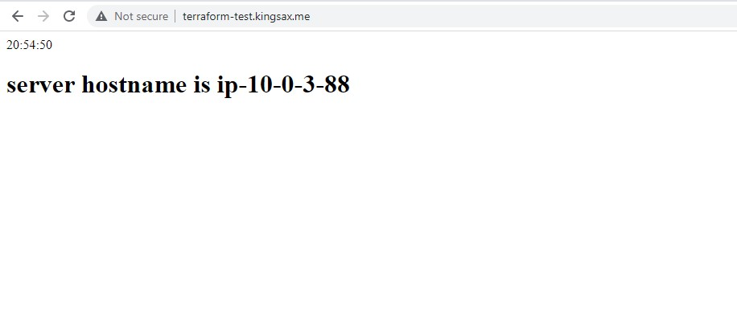
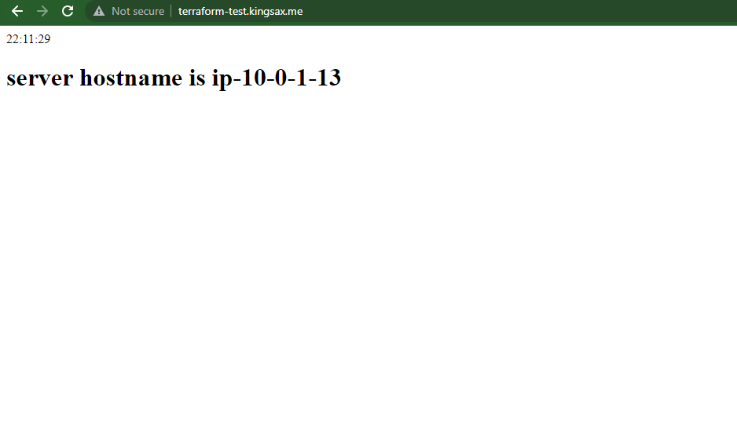
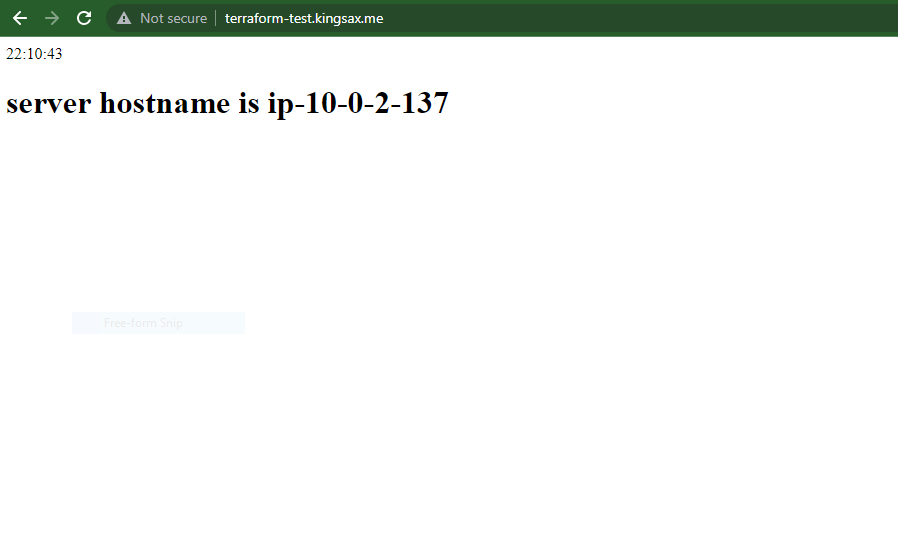

# Automation with Infrastructure as Code

Deploying a simple webpage showing Africa/Lagos timezone and hostname ip address of all servers using a single command bash script to run terraform and ansible scripts

- Execute the bashscript file "create.sh" to deploy the terraform and ansible scripts
- After deploying, the load balancer should point to the three servers showing the current time and private ip address

