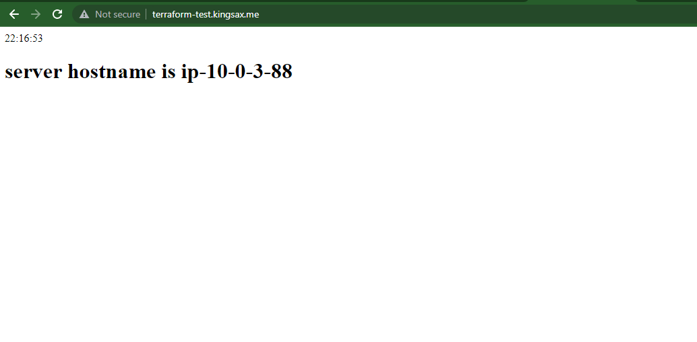

# Automation with Infrastructure as Code

Deploying a simple webpage showing Africa/Lagos timezone and hostname ip address of all servers using a single command bash script to run terraform and ansible scripts

<h3>TASKS</h3>

- Using Terraform, create 3 EC2 instances and put them behind a Load Balancer
- Get a .com.ng or any other domain name for yourself and set it up with AWS Route53 within your terraform plan, then add an A record for subdomain terraform-test that points to your Load Balancer IP address
- Create an Ansible script that uses the host-inventory file Terraform created to install Apache, set timezone to Africa/Lagos and displays a simple HTML page that displays content to clearly identify on all 3 EC2 instances.
- Your project is complete when one visits terraform-test.yoursdmain.com and it shows the content from your instances, while rotating between the servers as your refresh to display their unique content.
- Submit both the Ansible and Terraform files created

Execute the bashscript file "create.sh" to deploy the terraform and ansible scripts.  
After deploying, the load balancer should point to the three servers showing the current time and private ip address

